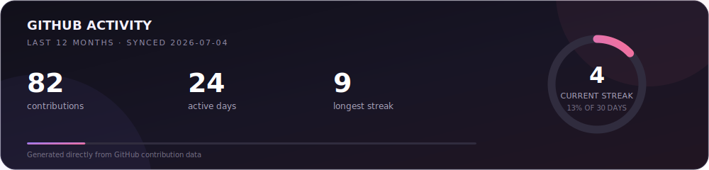

<!-- Header — adapts to system light/dark mode -->

  <picture>
    <source media="(prefers-color-scheme: dark)" srcset="./assets/header-banner-dark.svg" />
    <source media="(prefers-color-scheme: light)" srcset="./assets/header-banner-light.svg" />
    
  </picture>

<!-- Typing animation — theme-aware -->

  <picture>
    <source media="(prefers-color-scheme: dark)" srcset="https://readme-typing-svg.demolab.com?font=Fira+Code&weight=600&size=22&duration=3000&pause=900&color=8B7CFF&center=true&vCenter=true&width=620&lines=Full-stack+developer;Agentic+AI+builder;RAG+%26+multi-agent+systems;CS+student+%C2%B7+3rd+year" />
    <source media="(prefers-color-scheme: light)" srcset="https://readme-typing-svg.demolab.com?font=Fira+Code&weight=600&size=22&duration=3000&pause=900&color=6A42CC&center=true&vCenter=true&width=620&lines=Full-stack+developer;Agentic+AI+builder;RAG+%26+multi-agent+systems;CS+student+%C2%B7+3rd+year" />
    
  </picture>

<!-- Flickering inline decorations -->

  
  
  <a href="https://github.com/RaktheshTG?tab=repositories">Projects</a>
  &nbsp;·&nbsp;
  <a href="https://github.com/RaktheshTG/CustomerSupportAI">Agentic AI</a>
  &nbsp;·&nbsp;
  <a href="https://github.com/RaktheshTG/paperTrail">PaperTrail</a>
  &nbsp;·&nbsp;
  <a href="https://www.linkedin.com/in/rakthesh-tg">LinkedIn</a>
  &nbsp;·&nbsp;
  
  

 

## About me

I'm a third-year **Computer Science** student building products across the full stack, with a deep interest in **RAG pipelines, multi-agent workflows, and thoughtful interfaces**. I like turning ambitious AI ideas into software people can actually use.

 Open to software engineering and AI/ML internship opportunities

<!-- Animated terminal — theme-aware -->

  <picture>
    <source media="(prefers-color-scheme: dark)" srcset="./assets/terminal-dark.svg" />
    <source media="(prefers-color-scheme: light)" srcset="./assets/terminal-light.svg" />
    
  </picture>

 

## Tech stack

> Skills grouped by domain — badges adapt to your GitHub theme.

### Languages

  
  
  
  
  
  

### Web / Full-Stack

  
  
  
  
  

### AI / Agentic

  
  
  
  
  
  
  

### CS Fundamentals

  
  
  
  
  

### Tools

  
  
  
  
  

## Selected work

<table>
  <tr>
    <td width="50%" valign="top">
      <h3> <a href="https://github.com/RaktheshTG/paperTrail">PaperTrail</a></h3>
      
Turns research-paper URLs into approachable explanations, structured takeaways, and interactive concept maps for curious non-experts.

      
<code>TypeScript</code> <code>React</code> <code>TanStack</code> <code>Groq</code> <code>React Flow</code>

    </td>
    <td width="50%" valign="top">
      <h3> <a href="https://github.com/RaktheshTG/CustomerSupportAI">CustomerSupportAI</a></h3>
      
An agentic customer-support system with retrieval, supervisor routing, persistent memory, and human escalation built into the workflow.

      
<code>Python</code> <code>LangGraph</code> <code>RAG</code> <code>Multi-agent</code>

    </td>
  </tr>
  <tr>
    <td width="50%" valign="top">
      <h3><a href="https://github.com/RaktheshTG/UniFocus">UniFocus</a></h3>
      
A student productivity workspace for habits, focus sessions, calendars, progress, and recommendations—with account-backed cross-device sync.

      
<code>JavaScript</code> <code>Express</code> <code>MySQL</code> <code>REST API</code>

    </td>
    <td width="50%" valign="top">
      <h3> What I'm learning now</h3>
      
Advanced data structures and algorithms, production-minded AI systems, and the architecture patterns that keep agents observable and useful.

      
<code>DSA</code> <code>System design</code> <code>AI engineering</code>

    </td>
  </tr>
</table>

## GitHub activity

  <picture>
    <source media="(prefers-color-scheme: dark)" srcset="./assets/stats-card.svg" />
    <source media="(prefers-color-scheme: light)" srcset="./assets/stats-card-light.svg" />
    
  </picture>

The card is generated from GitHub's GraphQL API and refreshed daily by GitHub Actions. Light and dark variants follow your system theme.

---

  
   
  <i>Build the useful thing. Then make it delightful.</i>
   
  Toggle your OS light/dark mode to see the profile adapt ✨

