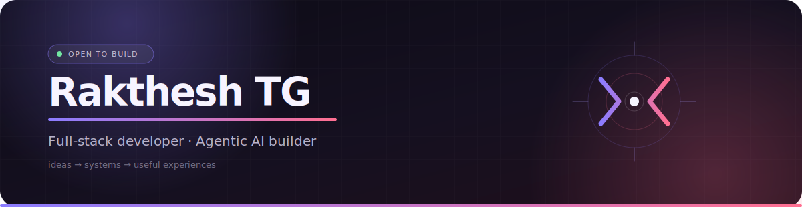

<div align="center">


<br/>

[](https://github.com/RaktheshTG)

</div>

---

<br/>

> ### 🔮 ── WHO I AM ──────────────────────────────
> * **🚀 Third-Year CSE Student** · Full-Stack Developer  
> * **🧠 Agentic AI Builder** · Custom RAG Pipelines & LangGraph Workflows  
> * **⚡ Academic Excellence** · JEE Advanced 2024 | 97.07%ile JEE Mains  
> * **💼 Open to Opportunities** · SWE & AI-ML Internships  
> ──────────────────────────────────────────────────

<br/>

## ⚡ CAPABILITIES & EXPERTISE

> ### 🛠️ ── WHAT I BUILD ──────────────────────────
> * **🌐 Full-Stack Web Applications** — React, Next.js, Express, FastAPI  
> * **🧬 RAG & Vector Search** — Custom embeddings, semantic search, Pinecone, LangChain  
> * **🤖 Multi-Agent Systems** — LangGraph orchestration, stateful workflows, tool-use  
> * **🎨 UI/UX Design** — Dark editorials, high-contrast interfaces, accessibility-first  
> * **📊 Backend Systems** — REST APIs, database optimization, authentication & security  
> ──────────────────────────────────────────────────

<br/>

## 🖥️ CURRENTLY

```bash
rakthesh@dev ~ % cat currently.txt

📦 BUILDING
  PaperTrail        → RAG-powered academic paper explainer with concept maps
  Whisper-based     → Offline lecture summarization & analysis tool

🎯 EXPLORING
  Advanced DSA      → Daily algorithm practice
  Agentic scaling   → Multi-agent architecture patterns
  
⚡ STATUS
  Actively open to SWE / AI-ML summer internships (2025-2026)

```
# Rakthesh TG

<!-- Header wave (static for README rendering) -->
<p align="center">
  
</p>
<p align="center">  </p>

Notes

The file assets/stats-card.svg is generated by the script `scripts/generate-stats.js`. The workflow `.github/workflows/update-stats.yml` will run it daily and commit the updated SVG.

To run locally, set `GITHUB_TOKEN` and `GITHUB_USER` environment variables and run:

```bash
GITHUB_TOKEN=YOUR_TOKEN GITHUB_USER=your-github-login node scripts/generate-stats.js
```

The script uses the GitHub GraphQL API to read your contribution calendar and fills the SVG template at `assets/stats-template.svg`. The generated file is `assets/stats-card.svg` which is referenced in this README.

Tweaks you can make

- Colors: edit `assets/header-wave.svg` or `assets/stats-template.svg` gradients.
- Ring target: pass `TARGET_STREAK` env var (number) to set the target used to compute ring percent.

If you want further improvements (animated ring easing, flame redesign, or dark/light theme switching), tell me which and I'll implement it.
